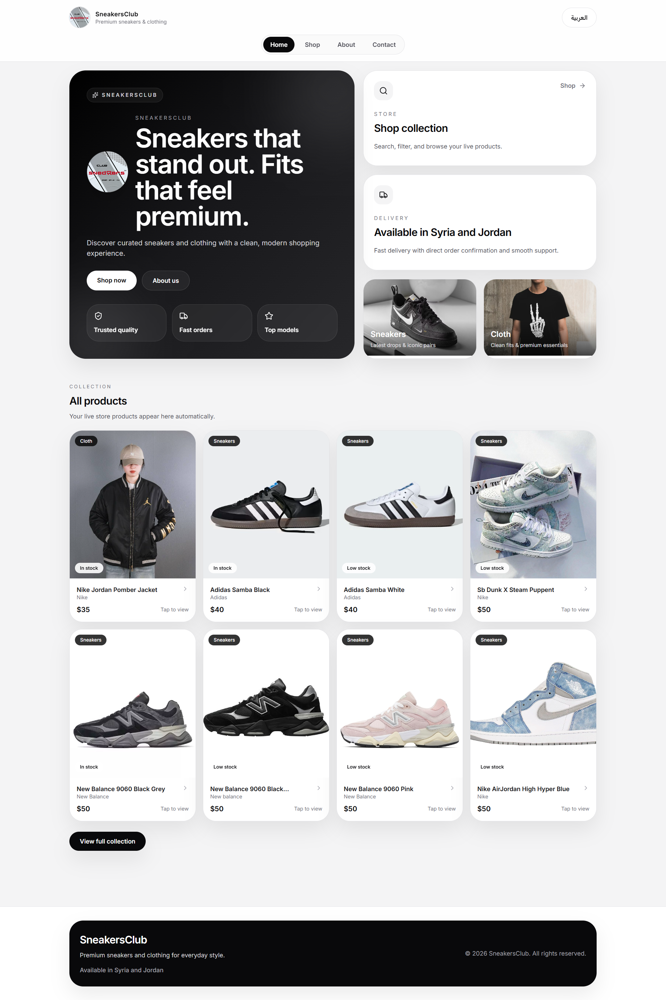

# SneakersClub

SneakersClub is a modern bilingual e-commerce web application for sneakers and clothing.

## Features
- Arabic / English support
- Responsive storefront
- Product pages with size selection
- Inventory by size and quantity
- Admin panel for products and orders
- Sales dashboard and analytics
- Supabase database and storage
- Admin email notifications
- Ready for Netlify deployment

## Tech Stack
- React
- Vite
- Tailwind CSS
- Supabase
- Recharts
- JavaScript

## Run locally
```bash
npm install
npm run dev

## Image:


